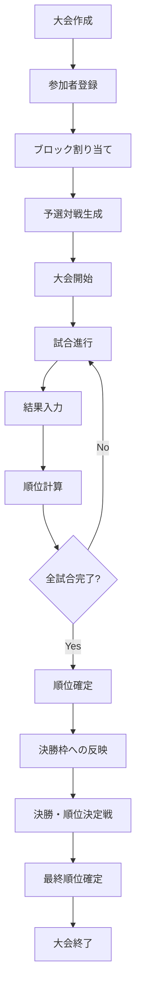
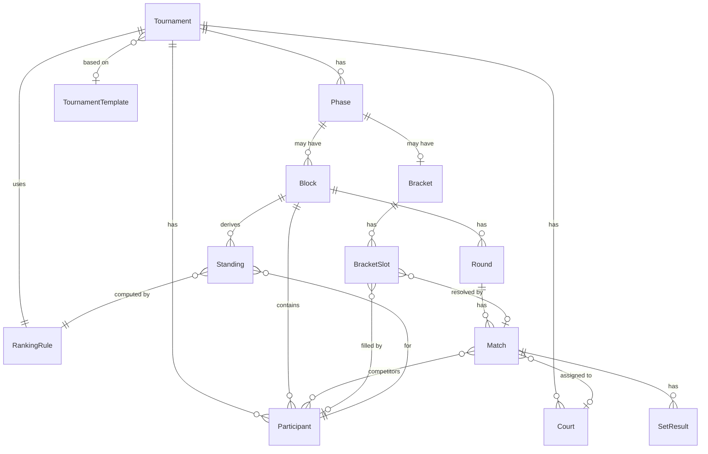
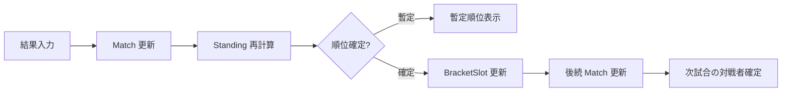
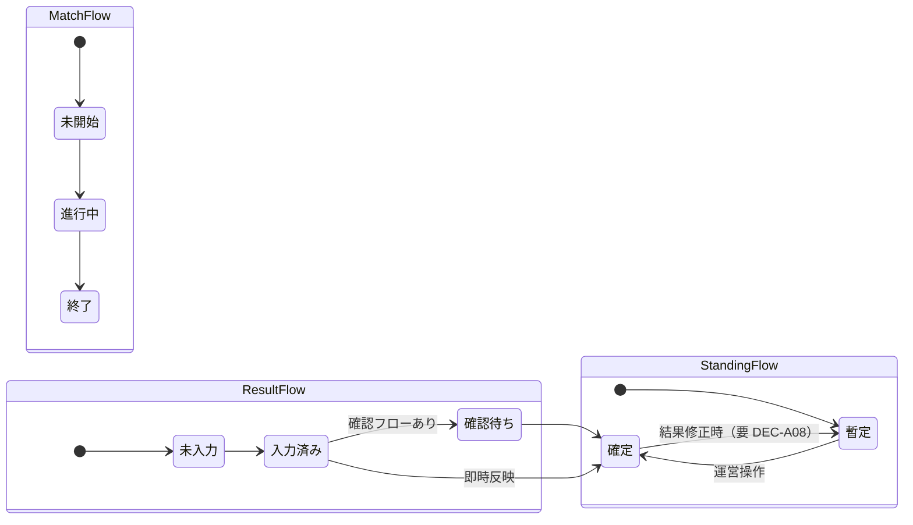
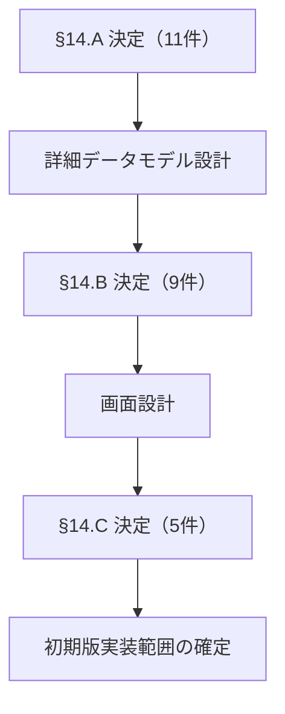

# SMATournament Architecture

全体設計ドキュメント。詳細なデータ項目・Firebase 構造・画面実装は別ドキュメントで定義する。

**関連ドキュメント**

- [requirements.md](requirements.md) — 機能要件・未確定事項
- [decision_log.md](decision_log.md) — SMA 内の決定記録

---

## 1. 全体方針

### 1.1 システムの位置づけ

- **SMATournament** は、大会全体（複数ブロック・多数試合・決勝トーナメント）を管理する **独立システム** とする
- **SMAScore**（1 試合の配信スコア表示）との完全連携は初期対象外とする
- 両者は別リポジトリ・別デプロイで運用し、必要に応じて将来連携を検討する

### 1.2 設計原則

| 原則 | 内容 |
|------|------|
| 差し替え可能な大会形式 | 大会形式（ブロック予選 / トーナメントのみ 等）を設定で切り替え、形式ごとに別システムを作らない |
| 差し替え可能な順位計算 | 順位計算ロジックを `RankingRule` として分離し、協会方式・アベレージ方式等を後から追加できる |
| 結果と順位の分離 | 試合結果（`Match` / `SetResult`）の保存と、順位（`Standing`）の算出を独立させる |
| 表示と内部データの分離 | 画面表示用の View と、永続化する Domain データを分ける |
| SMA 実運用優先 | 汎用性より、SMA 大会当日の運用に必要な構成を先に整える |

### 1.3 レイヤ構成（概念）

```
┌─────────────────────────────────────────┐
│  Presentation（画面・印刷・閲覧 URL）      │
├─────────────────────────────────────────┤
│  Application（大会進行・結果入力・順位確定）  │
├─────────────────────────────────────────┤
│  Domain（Tournament, Match, Standing 等） │
├─────────────────────────────────────────┤
│  Rules（RankingRule, 対戦表生成, 枠反映）   │
├─────────────────────────────────────────┤
│  Infrastructure（永続化・同期・履歴）      │
└─────────────────────────────────────────┘
```

詳細なモジュール分割・技術選定は詳細設計で行う。

---

## 2. 大会全体のライフサイクル

1 つの大会（`Tournament`）は、作成から終了まで以下の流れで進行する。



### 各段階の概要

| 段階 | 概要 | 主な構成要素 |
|------|------|--------------|
| 大会作成 | 大会名・形式・ルール・コート数等を設定 | `Tournament`, `RankingRule`, `Phase` |
| 参加者登録 | 選手またはチームを登録 | `Participant` |
| ブロック割り当て | 参加者をブロックへ配置、記号（A〜F 等）を付与 | `Block`, `Participant` |
| 予選対戦生成 | 公式方式に基づき試合・ラウンド・コート割り当てを生成 | `Phase`, `Round`, `Match`, `Court` |
| 試合進行 | コートで試合を実施 | `Match`, `Court` |
| 結果入力 | セット・試合結果を記録 | `Match`, `SetResult`, `ResultStatus` |
| 順位計算 | `RankingRule` に基づき暫定順位を算出 | `Standing`, `RankingRule` |
| 順位確定 | 運営がブロック順位を確定 | `Standing`, `StandingStatus` |
| 決勝枠への反映 | 確定順位を `BracketSlot` へ自動配置 | `Bracket`, `BracketSlot`, `Participant` |
| 決勝・順位決定戦 | トーナメント・順位決定戦を進行 | `Phase`, `Match`, `Bracket` |
| 最終順位確定 | 大会全体の最終順位を確定 | `Standing` |
| 大会終了 | 結果保存・公開 | `Tournament`, `TournamentStatus` |

**トーナメントのみ** の大会では、「ブロック割り当て」「予選対戦生成」「予選順位確定」を省略し、最初から `Bracket` フェーズへ進む。

---

## 3. 主要構成要素

各要素は **概念上のドメインオブジェクト** である。フィールド定義は詳細設計で行う。

### Tournament

大会全体のルートエンティティ。大会名・開催日・形式・現在フェーズ・状態を保持する。  
すべての下位要素（参加者・試合・順位・トーナメント表）は `Tournament` に所属する。

### Phase

大会内の **進行段階** を表す。予選・決勝トーナメント・順位決定戦等を、同一の `Match` / `Bracket` モデルで扱うための単位。  
大会形式によって有効な Phase の組み合わせが変わる（設定で表現）。

### Participant

大会に参加する **選手またはチーム**。名前・ID・所属ブロック・ブロック内記号・特殊状態（欠場・棄権等）を持つ。

### Block

予選フェーズにおける **参加者のグループ**。5 人または 6 人のブロックを想定。  
ブロック内の順位（`Standing`）と、決勝トーナメント枠へのマッピングの単位となる。

### Round

1 ブロック内（または 1 フェーズ内）の **ラウンド**。  
同一ラウンドで同時に進行する試合のまとまり。休憩者の判定にも使う。

### Match

**1 試合**。対戦者・コート・ラウンド・試合番号・状態・結果を持つ。  
予選・決勝・順位決定戦のいずれも同一の `Match` モデルで表現する。

### SetResult

**1 セット分の結果**。試合内の各セットについて、勝敗・引き分け・点数等を記録する。  
`Match` に従属する。セット単位の入力粒度は `decision_log.md` DEC-A04 / DEC-A05 で決定する。

### Standing

**順位表の 1 行** に相当する概念。参加者（またはチーム）の順位・集計値（セット取得数・引き分け数・合計点数等）・確定状態を表す。  
`RankingRule` によって算出され、`Match` / `SetResult` から **導出** される（試合結果そのものではない）。

### RankingRule

**順位計算方式** の定義。協会方式（セット取得数 → 引き分け数 → 合計点数）や、将来のアベレージ方式等を切り替えるためのルールセット。  
`Tournament` に紐づき、同一の `Standing` モデルに対して異なる計算ロジックを適用する。

### Bracket

**トーナメント表** 全体。決勝トーナメントおよび順位決定戦の構造を表す。  
`Phase` に属し、複数の `BracketSlot` を持つ。

### BracketSlot

トーナメント表上の **1 枠**。枠番号・進出条件（例：Block 1 の 1 位）・現在の参加者・次試合への接続を表す。  
予選順位確定時、および試合勝敗確定時に更新される。

### Court

**コート**（試合場）。同時進行数の上限と、試合への割り当てに使う。  
`Match` は 0 または 1 つの `Court` に割り当てられる。

### TournamentTemplate

**大会設定のひな型**。大会形式・ブロック構成・順位ルール・トーナメント枠マッピング等を保存し、新規大会作成時に再利用する。  
初期版では省略可能（requirements.md §14.C #22）。

---

## 4. 構成要素の関係

### 4.1 全体構造

```
Tournament
├── Participants[]
├── Courts[]
├── RankingRule
├── Phases[]
│   ├── Phase（予選）
│   │   ├── Blocks[]
│   │   │   ├── Participants[]（参照）
│   │   │   ├── Standings[]（導出）
│   │   │   └── Rounds[]
│   │   │       └── Matches[]
│   │   │           └── SetResults[]
│   │   └── ...
│   ├── Phase（決勝トーナメント）
│   │   └── Bracket
│   │       └── BracketSlots[]
│   │           └── Match（勝者決定試合）
│   │               └── SetResults[]
│   └── Phase（順位決定戦）
│       └── Bracket
│           └── BracketSlots[]
│               └── Match
│                   └── SetResults[]
└── TournamentTemplate（参照、任意）
```

### 4.2 関係図（Mermaid）



### 4.3 主要な参照方向

| 参照元 | 参照先 | 関係 |
|--------|--------|------|
| `Match` | `Participant` | 対戦者（2 名以上） |
| `Match` | `Court` | コート割り当て |
| `Match` | `Round` / `Phase` | 所属ラウンド・フェーズ |
| `Standing` | `Participant` | 順位の対象 |
| `Standing` | `Match`, `SetResult` | 集計元（参照のみ、嵌入しない） |
| `BracketSlot` | `Participant` | 進出者の配置 |
| `BracketSlot` | `Block`, `Standing` | 進出条件（例：Block 1 第 1 位） |
| `BracketSlot` | `Match` | 勝敗によって次枠へ反映 |

---

## 5. データの流れ

試合結果の入力から後続試合への反映まで、データは一方向に **再計算チェーン** として流れる。



### 5.1 各ステップの責務

| ステップ | 入力 | 出力 | 責務 |
|----------|------|------|------|
| 結果入力 | 利用者操作 | `SetResult` / `Match` の更新 | 試合結果を記録、`ResultStatus` を更新 |
| Match 更新 | `SetResult` | 更新された `Match` | 試合の勝者・特殊状態（不戦勝等）を確定 |
| Standing 再計算 | `Match[]`, `RankingRule` | 更新された `Standing[]` | 暫定順位を算出（`StandingStatus` = 暫定） |
| 順位確定 | 運営操作 | `Standing[]`（確定） | ブロック順位を確定（`StandingStatus` = 確定） |
| BracketSlot 更新 | 確定 `Standing[]`, 枠マッピング定義 | 更新された `BracketSlot[]` | 進出者名をトーナメント枠へ配置 |
| 後続 Match 更新 | `BracketSlot[]`, 完了 `Match` | 更新された `Match[]` | 勝者・敗者を次試合 / 順位決定戦枠へ反映 |

### 5.2 再計算の原則

- **結果変更時**は、`Match` 以降のチェーンを再実行する（requirements.md §11 設計方針）
- **Standing** は常に `Match` / `SetResult` から再算出可能であること（Single Source of Truth は試合結果）
- **BracketSlot** の参加者配置は、確定 `Standing` と試合勝敗の両方から更新される
- 再計算範囲（順位確定後・決勝開始後の修正可否）は `decision_log.md` DEC-A08 で決定する

---

## 6. 大会フェーズ

### 6.1 フェーズ種別

| フェーズ | 概要 | 主な構成要素 |
|----------|------|--------------|
| 予選 | ブロック内 round-robin 的な予選 | `Block`, `Round`, `Match`, `Standing` |
| 決勝トーナメント | 予選通過者によるトーナメント | `Bracket`, `BracketSlot`, `Match` |
| 順位決定戦 | 敗退者等の順位確定試合 | `Bracket`, `BracketSlot`, `Match` |
| トーナメントのみ | 予選なし、トーナメント単独 | `Bracket`, `BracketSlot`, `Match` |

### 6.2 設定による表現

フェーズごとに **別システム・別データモデルを作らない**。  
`Phase` の `type`（概念）と、紐づく `Block` または `Bracket` の有無で差異を表現する。

```
大会形式 = 有効な Phase の組み合わせ（設定）

例1: ブロック予選 → 決勝 → 順位決定戦
  Phase[予選] → Phase[決勝] → Phase[順位決定戦]

例2: トーナメントのみ
  Phase[決勝]

例3: ブロック予選 → 決勝（順位決定戦なし）
  Phase[予選] → Phase[決勝]
```

### 6.3 フェーズ間の接続

- **予選 → 決勝:** 確定 `Standing` と事前定義の枠マッピング → `BracketSlot` へ反映
- **決勝 → 順位決定戦:** 試合敗者を `BracketSlot`（順位決定戦側）へ反映
- **試合勝敗 → 次枠:** 同一 `Bracket` 内の `BracketSlot` チェーンで `Match` を更新

---

## 7. 順位計算の分離

### 7.1 分離方針

```
Match / SetResult（事実）
        ↓
   RankingRule（計算方式）
        ↓
    Standing（導出結果）
```

- **試合結果** は入力の事実として `Match` / `SetResult` に保存する
- **順位** は `RankingRule` を適用して `Standing` として算出する
- 結果修正時は `Standing` を直接書き換えず、**再計算** する（手動順位確定は運営操作として例外扱い）

### 7.2 RankingRule の役割

| 責務 | 内容 |
|------|------|
| 順位条件の定義 | セット取得数・引き分け数・合計点数等の優先順位 |
| ソート方向 | 各条件の昇順 / 降順 |
| 特殊状態の扱い | 不戦勝・棄権・欠場・失格の集計への影響 |
| 暫定順位の算出 | 未入力試合がある場合の計算方法 |
| 同順位処理 | 同順位が残る場合の扱い |

### 7.3 方式の切り替え

| 方式 | 状態 | 備考 |
|------|------|------|
| 日本モルック協会方式 | 初期版の第一候補 | 詳細は `decision_log.md` DEC-A04〜A10 で決定 |
| アベレージ方式 | 将来拡張 | 本 Architecture ではインターフェースのみ想定 |
| カスタム方式 | 将来拡張 | `RankingRule` の差し替えで対応 |

**初期版で実装する方式** は、SMA 内の決定（`decision_log.md`）後に確定する。  
Architecture 上は **協会方式を第一候補** としつつ、`RankingRule` を差し替え可能に設計する。

---

## 8. 状態管理

具体的な列挙値（enum）は詳細設計で定義する。  
ここでは **状態概念** と **遷移の考え方** のみ整理する。

### 8.1 TournamentStatus

大会全体の状態。

| 概念 | 意味（概要） |
|------|--------------|
| 準備中 | 作成・設定・参加者登録中 |
| 進行中 | 試合進行・結果入力中 |
| 終了 | 最終順位確定・大会クローズ |

### 8.2 PhaseStatus

各 `Phase` の進行状態。

| 概念 | 意味（概要） |
|------|--------------|
| 未開始 | フェーズ開始前 |
| 進行中 | 試合・結果入力が進行中 |
| 完了 | フェーズ内の全試合・順位確定が完了 |

### 8.3 MatchStatus

1 試合の進行状態。

| 概念 | 意味（概要） |
|------|--------------|
| 未開始 | 試合開始前 |
| 進行中 | 試合実施中 |
| 終了 | 結果確定済み |
| 特殊 | 不戦勝・棄権等（詳細は DEC-A07 で決定） |

### 8.4 ResultStatus

試合結果の **入力・確認** 状態。確認フローの要否は DEC-A02 / DEC-A03 で決定する。

| 概念 | 意味（概要） |
|------|--------------|
| 未入力 | 結果なし |
| 入力済み | 結果が入力された（確認前または即反映） |
| 確認待ち | 運営確認待ち（確認フロー採用時） |
| 確定 | 順位計算に反映される状態 |

### 8.5 StandingStatus

順位の **確定度**。

| 概念 | 意味（概要） |
|------|--------------|
| 暫定 | 未入力試合がある、または結果変更の可能性がある |
| 確定 | 運営が順位を確定した |

### 8.6 状態遷移（概要）



---

## 9. 権限の考え方

認証方式（ログイン / URL / パスコード等）は **本 Architecture では決定しない**（requirements.md §14.B #15, #16）。  
ここでは **どの構成要素に対して、どのロールが操作権限を必要とするか** のみ整理する。

### 9.1 ロール一覧

| ロール | 概要 |
|--------|------|
| 大会本部 | 大会全体の管理・最終判断 |
| 運営スタッフ | 当日運営の補助 |
| コート担当 | 担当コートの試合進行・結果回収 |
| 選手または代表者 | 自身に関する情報の閲覧・結果入力（要否は未確定） |
| 閲覧者 | 公開情報の閲覧のみ |

### 9.2 構成要素 × 操作権限

| 構成要素 | 大会本部 | 運営スタッフ | コート担当 | 選手/代表 | 閲覧者 |
|----------|:--------:|:------------:|:----------:|:---------:|:------:|
| `Tournament` 設定 | 作成・変更 | — | — | — | — |
| `Participant` | 登録・変更 | 参照 | — | 自身のみ | — |
| `Block` 構成 | 作成・変更 | 参照 | — | 自身のみ | — |
| `Match` 結果入力 | ○ | ○ | 担当コート | 未確定 | — |
| `Match` 結果修正 | ○ | 未確定 | 未確定 | — | — |
| `Standing` 参照 | ○ | ○ | ○ | 自身のみ | 公開範囲 |
| `Standing` 確定 | ○ | — | — | — | — |
| `BracketSlot` 参照 | ○ | ○ | ○ | ○ | 公開範囲 |
| `BracketSlot` 手動調整 | ○ | — | — | — | — |
| 大会進行（Phase 遷移） | ○ | — | — | — | — |

**凡例:** ○ = 操作可、— = 操作不可、未確定 = `decision_log.md` / requirements.md §14.B で決定

### 9.3 権限設計の原則

- 権限は **ロール** と **スコープ**（全体 / コート / 自身）の組み合わせで表現する
- 結果入力権限（DEC-A01）が決まれば、コート担当・選手の列が確定する
- 閲覧者の公開範囲（DEC-B18 に相当する #18）は、表示レイヤで制御する

---

## 10. 初期版の境界

requirements.md §15 の受入条件を満たす **最小構成** を初期版とする。

### 10.1 初期版に含めるもの

| 領域 | 内容 |
|------|------|
| 大会作成 | 大会名・開催日・形式・ブロック数・コート数・順位ルール・決勝枠マッピング |
| 参加者 | 登録・ブロック割り当て・記号（A〜F 等） |
| 予選 | 5 人 / 6 人ブロック、公式対戦順による試合生成、コート割り当て |
| 結果入力 | 試合結果の入力・修正、入力者・時刻の記録 |
| 順位 | 暫定順位の自動計算、運営による順位確定 |
| 決勝 | 確定順位の `BracketSlot` への自動反映、勝者の次枠反映 |
| 順位決定戦 | 基本対応（詳細構成は DEC-B12 で決定） |
| トーナメントのみ | 予選なしの大会形式 |
| 出力 | 対戦表・順位表の印刷 |
| 永続化 | localStorage による保存・復元（Firebase は初期版対象外の可能性） |

### 10.2 初期版に含めないもの

| 領域 | 内容 | 参照 |
|------|------|------|
| SMAScore 連携 | 配信スコアとのデータ連携 | requirements.md §1 |
| 大会テンプレート | 設定の保存・再利用 | §14.C #22 |
| Firebase 同期 | 複数端末リアルタイム同期 | §14.C #23 |
| オフライン対応 | 通信切断時の自動同期 | §14.C #24 |
| 進行遅延表示 | タイムスケジュールに基づく遅延判定 | §14.C #25 |
| カスタム大会形式 | 公式方式以外のルール変更 | §14.C #21 |
| 大規模認証 | アカウントログイン・ユーザー管理 | §14.B #15 |
| 将来形式 | 総当たり・スイスドロー等 | requirements.md §2 |

### 10.3 初期版の完成イメージ

```
[準備] 大会作成 → 参加者登録 → ブロック割り当て → 予選対戦生成
                          ↓
[当日] 結果入力 → 暫定順位 → 順位確定 → 決勝枠反映
                          ↓
[決勝] 決勝・順位決定戦 → 結果入力 → 最終順位確定 → 大会終了
```

---

## 11. 未確定事項

全体設計に影響する未確定事項を、`requirements.md` §14 および `decision_log.md` から整理する。  
**確定前に詳細設計へ進んではならない項目** と、**Architecture は確定済みだが詳細設計で決める項目** を分けて記載する。

### 11.1 データモデル設計のブロッカー（decision_log.md §14.A）

| Decision ID | 論点 | Architecture への影響 |
|-------------|------|----------------------|
| DEC-A01 | 誰が結果を入力するか | 権限モデル、`ResultStatus` の入力者記録 |
| DEC-A02 | 即時反映 vs 確認後反映 | `ResultStatus` の状態遷移、再計算トリガー |
| DEC-A03 | 二重入力・照合 | `Match` に複数入力を保持するか、照合ロジックの要否 |
| DEC-A04 | 各セットで何を入力するか | `SetResult` の構造 |
| DEC-A05 | 合計点数の入力単位 | `SetResult` の粒度、Standing 集計方法 |
| DEC-A06 | 完全同順位時の処理 | `Standing` の同順位表現、手動確定 UI の要否 |
| DEC-A07 | 不戦勝・棄権・欠場・失格 | `Match` / `Participant` の特殊状態、`RankingRule` の例外処理 |
| DEC-A08 | 順位確定後の修正範囲 | 再計算チェーンの適用範囲、`StandingStatus` 遷移 |
| DEC-A09 | 各順位条件の昇順/降順 | `RankingRule` のソート定義 |
| DEC-A10 | 未入力試合の暫定順位 | `RankingRule` の暫定算出、`StandingStatus` |
| DEC-A11 | 5 人・6 人公式対戦順 | 対戦表生成ロジック、`Round` / `Match` の生成数 |

**現状:** 11 件すべて「未検討」（decision_log.md 2026-07-17 時点）

### 11.2 画面設計前に決定が必要（requirements.md §14.B）

| # | 論点 | Architecture への影響 |
|---|------|----------------------|
| #12 | 順位決定戦の標準構成 | `Bracket` / `BracketSlot` の構造パターン |
| #13 | BYE 処理 | `BracketSlot` の BYE 表現、自動勝ち上がり |
| #14 | 対戦表の手動修正 | `Match` の編集 API / 再生成ポリシー |
| #15 | 認証の必要性 | Infrastructure レイヤの構成 |
| #16 | 権限分離の実装方式 | Presentation レイヤのアクセス制御 |
| #17 | 同時編集の競合解決 | Infrastructure レイヤの同期戦略 |
| #18 | 閲覧 URL の公開範囲 | Presentation レイヤの View 分割 |
| #19 | 運営スタッフの操作範囲 | §9 権限マトリクスの確定 |
| #20 | コート担当・選手の操作範囲 | §9 権限マトリクスの確定 |

### 11.3 初期版の範囲に影響（requirements.md §14.C）

| # | 論点 | Architecture への影響 |
|---|------|----------------------|
| #21 | カスタム範囲 | `RankingRule` / `Phase` 設定の柔軟性 |
| #22 | 大会テンプレート | `TournamentTemplate` 機能の要否 |
| #23 | Firebase 導入時期 | Infrastructure レイヤ（localStorage vs Firebase） |
| #24 | オフライン動作 | Infrastructure レイヤ |
| #25 | 進行遅延表示 | `Match` / `Court` にスケジュール概念を追加するか |

### 11.4 決定の優先順位



---

## 更新履歴

| 日付 | 内容 |
|------|------|
| 2026-07-17 | 初版作成（全体設計） |
