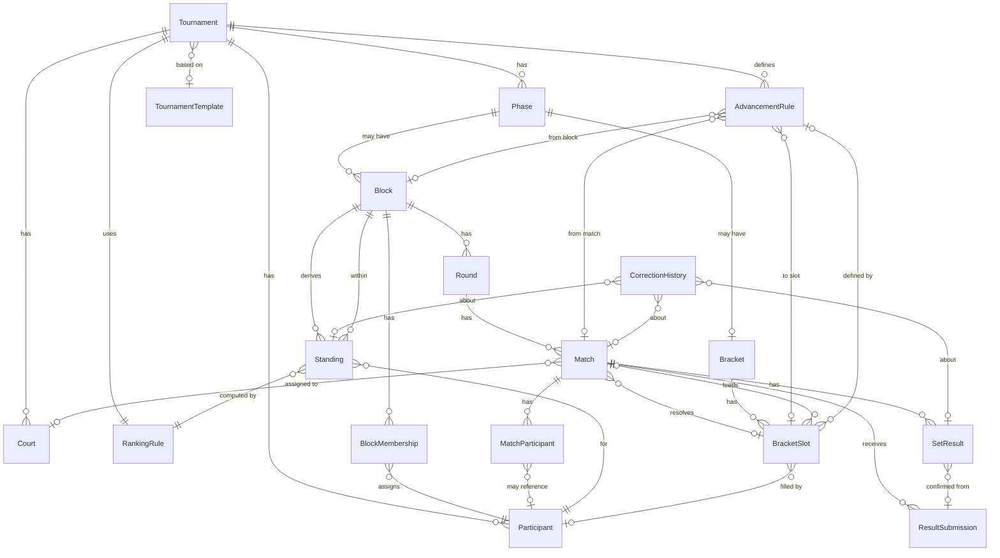
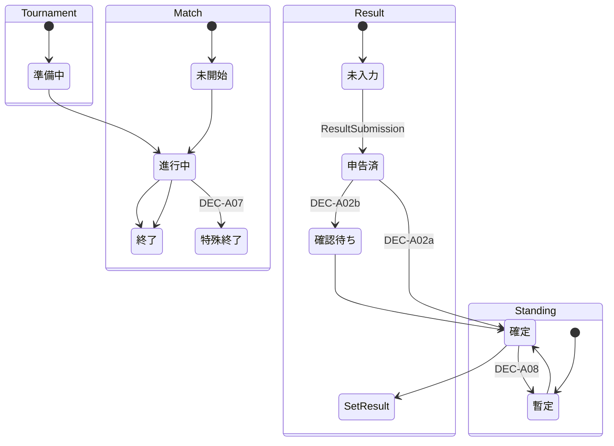
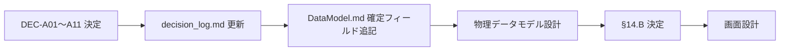

# SMATournament Logical Data Model

論理データモデルの詳細設計。保存方式（localStorage / Firebase 等）や実装言語に依存しない。

**関連ドキュメント**

- [Architecture.md](Architecture.md) — 全体設計・構成要素・データの流れ
- [requirements.md](requirements.md) — 機能要件
- [decision_log.md](decision_log.md) — 未確定事項の決定記録（DEC-A01〜A11）

---

## 1. 目的

- [Architecture.md](Architecture.md) で定義した構成要素を、**論理データモデル**として整理する
- 永続化方式・同期方式・UI 実装に **依存しない** エンティティと関係の定義とする
- [decision_log.md](decision_log.md) の未確定事項（DEC-A01〜A11）を **推測で確定せず**、影響範囲と複数案のみ記載する
- 物理データモデル（JSON スキーマ、DB パス等）は別ドキュメントで定義する

---

## 2. データ分類

各エンティティを以下の 6 分類に割り当てる。

| 分類 | 定義 | 該当エンティティ |
|------|------|------------------|
| **マスタデータ** | 大会内で参照される基本エンティティ。比較的安定 | `Tournament`, `Participant`, `Court`, `Phase`, `Block`, `Round`, `Match`, `Bracket`, `BracketSlot` |
| **設定データ** | 大会ルール・進出条件・計算方式の定義 | `TournamentTemplate`, `RankingRule`, `AdvancementRule`, `BlockMembership` |
| **運用データ** | 大会進行中に更新される状態・割り当て | `MatchParticipant`, `MatchStatus`（概念）, `TournamentStatus`（概念） |
| **結果データ** | 試合・セットの入力事実 | `SetResult`, `ResultSubmission` |
| **導出データ** | 結果データから再計算可能な集計・配置 | `Standing`, `RankingMetric`（概念）, `BracketSlot` の参加者配置（一部） |
| **履歴データ** | 変更の記録。元データを上書きしない | `CorrectionHistory` |

**補足**

- `Standing` は導出データだが、運営による **順位確定** 操作の状態（`StandingStatus`）を保持する
- `BracketSlot` はマスタ（枠構造）と運用（現在の参加者配置）の両面を持つ

---

## 3. エンティティ一覧

各エンティティについて、論理レベルの属性のみ記載する。**具体的フィールド名・型は DEC-A 決定後に確定**する。

---

### Tournament

| 項目 | 内容 |
|------|------|
| **役割** | 大会全体のルート。すべての下位データのスコープ |
| **生成タイミング** | 大会作成操作時 |
| **更新タイミング** | 設定変更、フェーズ進行、大会開始・終了時 |
| **削除・無効化** | 論理削除またはアーカイブを想定。進行中大会の物理削除は原則不可 |
| **元 / 導出** | 元データ |
| **関連エンティティ** | `Phase`, `Participant`, `Court`, `RankingRule`, `AdvancementRule`, `TournamentTemplate`（任意） |
| **未確定事項** | DEC-A08（確定後の修正範囲）→ 大会状態遷移 |

---

### TournamentTemplate

| 項目 | 内容 |
|------|------|
| **役割** | 大会設定のひな型。新規 `Tournament` 作成時の初期値ソース |
| **生成タイミング** | テンプレート保存時（初期版では未実装の可能性） |
| **更新タイミング** | テンプレート編集時 |
| **削除・無効化** | 論理削除。参照中テンプレートは無効化のみ |
| **元 / 導出** | 元データ（設定のスナップショット） |
| **関連エンティティ** | `Tournament`（参照元）、`RankingRule`, `AdvancementRule`, `Phase` 構成定義 |
| **未確定事項** | requirements.md §14.C #22（テンプレート機能の要否） |

---

### Participant

| 項目 | 内容 |
|------|------|
| **役割** | 大会参加者（選手またはチーム）。名前・ID・大会内の存在を表す |
| **生成タイミング** | 参加者登録時 |
| **更新タイミング** | 名前変更、特殊状態（欠場・棄権・失格等）の変更 |
| **削除・無効化** | 原則論理削除。試合結果が存在する場合は無効化のみ |
| **元 / 導出** | 元データ |
| **関連エンティティ** | `Tournament`, `BlockMembership`, `MatchParticipant`, `Standing`, `BracketSlot` |
| **未確定事項** | DEC-A07（棄権・欠場・失格の扱い）→ 特殊状態の属性 |

---

### Phase

| 項目 | 内容 |
|------|------|
| **役割** | 大会内の進行段階（予選 / 決勝トーナメント / 順位決定戦 等） |
| **生成タイミング** | 大会作成時（大会形式に応じた Phase セットを生成） |
| **更新タイミング** | フェーズ開始・完了時 |
| **削除・無効化** | 大会準備中のみ削除可。進行開始後は無効化不可 |
| **元 / 導出** | 元データ |
| **関連エンティティ** | `Tournament`, `Block`（予選 Phase）, `Bracket`（決勝・順位決定戦 Phase）, `Round`, `Match` |
| **未確定事項** | —（Phase 種別は Architecture.md §6 で概念確定） |

---

### Block

| 項目 | 内容 |
|------|------|
| **役割** | 予選フェーズ内の参加者グループ。順位計算・決勝進出の単位 |
| **生成タイミング** | ブロック割り当て / 対戦表生成前 |
| **更新タイミング** | ブロック構成変更（準備中のみ）、順位確定時 |
| **削除・無効化** | 準備中のみ。試合生成後は無効化不可 |
| **元 / 導出** | 元データ |
| **関連エンティティ** | `Phase`, `BlockMembership`, `Round`, `Match`, `Standing`, `AdvancementRule` |
| **未確定事項** | DEC-A11（5 人・6 人公式対戦順）→ ブロック人数・試合数 |

---

### BlockMembership

| 項目 | 内容 |
|------|------|
| **役割** | `Participant` と `Block` の所属関係。ブロック内記号（A〜F 等）を保持 |
| **生成タイミング** | ブロック割り当て時 |
| **更新タイミング** | 参加者のブロック移動（準備中）、記号変更 |
| **削除・無効化** | 試合未生成時のみ削除可。生成後は無効化 |
| **元 / 導出** | 元データ（設定データに近い） |
| **関連エンティティ** | `Block`, `Participant`, `Standing` |
| **未確定事項** | —（記号 A〜F は requirements.md §5 で要件確定） |

**設計意図:** `Participant` にブロック ID を直接持たせず、所属関係を独立エンティティにすることで、将来のブロック再割り当て・履歴管理に備える。

---

### Round

| 項目 | 内容 |
|------|------|
| **役割** | 1 ブロック（または 1 フェーズ）内のラウンド。同時進行試合のまとまり |
| **生成タイミング** | 予選対戦表生成時 |
| **更新タイミング** | ラウンド開始・完了時 |
| **削除・無効化** | 対戦表再生成時に削除（試合結果がなければ） |
| **元 / 導出** | 元データ |
| **関連エンティティ** | `Block`, `Phase`, `Match` |
| **未確定事項** | DEC-A11 → ラウンド数・各ラウンドの試合構成 |

---

### Court

| 項目 | 内容 |
|------|------|
| **役割** | 試合場。同時進行数の上限管理と `Match` への割り当て |
| **生成タイミング** | 大会作成時（コート数に応じて） |
| **更新タイミング** | コート数変更（準備中）、試合への割り当て |
| **削除・無効化** | 準備中のみ |
| **元 / 導出** | 元データ |
| **関連エンティティ** | `Tournament`, `Match` |
| **未確定事項** | requirements.md §14.C #25（進行遅延）→ 将来スケジュール属性の追加可能性 |

---

### Match

| 項目 | 内容 |
|------|------|
| **役割** | 1 試合。予選・決勝・順位決定戦を同一モデルで表現 |
| **生成タイミング** | 対戦表生成時、または `Bracket` 構造生成時 |
| **更新タイミング** | コート割り当て、試合進行、結果確定、対戦者の自動流入 |
| **削除・無効化** | 結果未入力かつ再生成時のみ削除。結果入力後は無効化＋履歴 |
| **元 / 導出** | 元データ |
| **関連エンティティ** | `Round`, `Phase`, `Court`, `MatchParticipant`, `SetResult`, `ResultSubmission`, `BracketSlot` |
| **未確定事項** | DEC-A02, DEC-A03, DEC-A07, DEC-A08, DEC-A11 |

**設計意図:** 対戦者は `MatchParticipant` 経由で関連付ける（§6 参照）。`Match` 自体は試合の容器・状態・所属のみを担う。

---

### MatchParticipant

| 項目 | 内容 |
|------|------|
| **役割** | 1 試合への参加者割り当て。スロット番号・BYE・未確定枠・勝敗結果を表現 |
| **生成タイミング** | 対戦表生成時、または `BracketSlot` からの自動流入時 |
| **更新タイミング** | 対戦者確定、試合結果確定、BYE 処理、勝者/敗者の次試合流入 |
| **削除・無効化** | 試合再生成時。結果確定後の削除は `CorrectionHistory` とセット |
| **元 / 導出** | 元データ（運用データ） |
| **関連エンティティ** | `Match`, `Participant`（または未確定）, `BracketSlot`（流入元） |
| **未確定事項** | DEC-A07（不戦勝・棄権）→ BYE / 特殊結果の表現 |

---

### SetResult

| 項目 | 内容 |
|------|------|
| **役割** | 1 セット分の **確定した** 競技結果（勝敗・引き分け・点数等） |
| **生成タイミング** | 結果が確定した時点（即時反映 or 確認後 — DEC-A02 依存） |
| **更新タイミング** | 結果修正時（旧レコードは履歴へ、または `CorrectionHistory` で追跡） |
| **削除・無効化** | 原則削除不可。修正は上書き＋履歴 |
| **元 / 導出** | 元データ（結果データ） |
| **関連エンティティ** | `Match`, `MatchParticipant`, `ResultSubmission`（入力元） |
| **未確定事項** | DEC-A04, DEC-A05, DEC-A07 |

---

### ResultSubmission

| 項目 | 内容 |
|------|------|
| **役割** | 利用者による **結果の申告**（入力事実）。確認前・照合前のデータを保持 |
| **生成タイミング** | 結果入力操作時 |
| **更新タイミング** | 再入力、確認、却下、照合 |
| **削除・無効化** | 論理削除。修正・却下は履歴として保持 |
| **元 / 導出** | 元データ（結果データ / 入力申告） |
| **関連エンティティ** | `Match`, `SetResult`（確定後に生成）, `CorrectionHistory` |
| **未確定事項** | DEC-A01, DEC-A02, DEC-A03 |

**設計意図:** `SetResult`（確定結果）と `ResultSubmission`（申告内容）を分離し、確認フロー・二重入力の有無に柔軟対応する（§7 参照）。

---

### Standing

| 項目 | 内容 |
|------|------|
| **役割** | 1 参加者の順位行。順位値・集計指標・確定状態を保持 |
| **生成タイミング** | 初回順位計算時（結果入力後） |
| **更新タイミング** | 結果変更による再計算、運営による順位確定・手動調整 |
| **削除・無効化** | 再計算で上書き。ブロック再構成時は再生成 |
| **元 / 導出** | **導出データ**（`Match` / `SetResult` / `RankingRule` から再計算可能） |
| **関連エンティティ** | `Participant`, `Block`, `RankingRule`, `RankingMetric`, `AdvancementRule`, `BracketSlot` |
| **未確定事項** | DEC-A06, DEC-A08, DEC-A09, DEC-A10 |

---

### RankingRule

| 項目 | 内容 |
|------|------|
| **役割** | 順位計算方式の定義。条件の優先順位・ソート方向・特殊状態ルール |
| **生成タイミング** | 大会作成時（テンプレートまたはデフォルトから） |
| **更新タイミング** | 大会準備中のルール変更（進行中変更は原則不可） |
| **削除・無効化** | `Tournament` に紐づく限り削除不可 |
| **元 / 導出** | 元データ（設定データ） |
| **関連エンティティ** | `Tournament`, `Standing`, `RankingMetric` 定義 |
| **未確定事項** | DEC-A07, DEC-A09, DEC-A10 |

---

### Bracket

| 項目 | 内容 |
|------|------|
| **役割** | トーナメント表全体（決勝 or 順位決定戦）。`Phase` に 1:1 で紐づく |
| **生成タイミング** | 大会作成時（構造定義）、または予選完了後 |
| **更新タイミング** | 構造変更（準備中）、進行状態の更新 |
| **削除・無効化** | 準備中のみ |
| **元 / 導出** | 元データ |
| **関連エンティティ** | `Phase`, `BracketSlot`, `Match`, `AdvancementRule` |
| **未確定事項** | requirements.md §14.B #12（順位決定戦構成）, #13（BYE） |

---

### BracketSlot

| 項目 | 内容 |
|------|------|
| **役割** | トーナメント表上の 1 枠。参加者配置・次試合接続・BYE を表現 |
| **生成タイミング** | `Bracket` 生成時 |
| **更新タイミング** | 予選順位確定後の参加者配置、試合勝敗確定後の勝者/敗者流入 |
| **削除・無効化** | 構造変更（準備中）のみ |
| **元 / 導出** | 枠構造＝元データ、現在の参加者＝運用データ（一部導出：勝敗から流入） |
| **関連エンティティ** | `Bracket`, `Participant`, `Match`, `MatchParticipant`, `AdvancementRule`, `Standing` |
| **未確定事項** | DEC-A06, DEC-A08, requirements.md §14.B #13（BYE） |

---

### AdvancementRule

| 項目 | 内容 |
|------|------|
| **役割** | 進出・流入ルール。ブロック順位→枠、試合勝敗→次枠のマッピング定義 |
| **生成タイミング** | 大会作成時 |
| **更新タイミング** | 大会準備中のマッピング変更 |
| **削除・無効化** | 参照される `BracketSlot` が存在する間は変更は新ルール追加 |
| **元 / 導出** | 元データ（設定データ） |
| **関連エンティティ** | `Tournament`, `Block`, `Standing`, `BracketSlot`, `Match` |
| **未確定事項** | DEC-A06（同順位時の手動調整と競合）, requirements.md §14.B #12 |

---

### CorrectionHistory

| 項目 | 内容 |
|------|------|
| **役割** | 結果・順位・配置の修正履歴。誰が・いつ・何を・なぜ変更したか |
| **生成タイミング** | 修正操作の都度（追記のみ） |
| **更新タイミング** | 更新不可（追記のみ） |
| **削除・無効化** | 削除不可 |
| **元 / 導出** | 履歴データ |
| **関連エンティティ** | `Match`, `SetResult`, `ResultSubmission`, `Standing`, `BracketSlot`, 操作者（未確定） |
| **未確定事項** | DEC-A01（操作者の記録）, DEC-A08（修正可能範囲） |

---

## 4. 関係図

### 4.1 主要 ER 図



### 4.2 重点関係の説明

| 関係 | カーディナリティ | 説明 |
|------|------------------|------|
| **Tournament → Phase** | 1 : N | 大会形式により Phase の数・種類が変わる |
| **Tournament → Participant** | 1 : N | 参加者は大会に直接所属。ブロック所属は `BlockMembership` 経由 |
| **Phase → Block / Bracket** | 1 : 0..N / 0..1 | 予選 Phase は `Block`、決勝 Phase は `Bracket` |
| **Block → BlockMembership** | 1 : N | 1 参加者は同時に 1 ブロックのみ（予選 Phase 内） |
| **Match → MatchParticipant** | 1 : N | 2 名（通常）〜 N 名（将来）+ BYE スロット |
| **Match → SetResult** | 1 : N | 1 試合に複数セット。確定結果のみ |
| **Match → ResultSubmission** | 1 : N | 1 試合に複数申告（二重入力・再入力含む） |
| **Match / SetResult → Standing** | N : M（導出） | 試合結果を集計して Standing を **再計算** |
| **Standing → BracketSlot** | N : M（via AdvancementRule） | 確定 Standing + ルール → 枠へ配置 |
| **BracketSlot → 後続 Match** | 1 : 0..1 | 枠の参加者が `MatchParticipant` として次試合へ流入 |
| **RankingRule → Standing** | 1 : N | 同一ルールで Block 内全 Standing を算出 |

---

## 5. Single Source of Truth

### 5.1 原則

| データ種別 | Single Source of Truth | 備考 |
|------------|------------------------|------|
| **試合結果（確定）** | `SetResult` + 確定済み `Match` 状態 | `ResultSubmission` は確定前の申告 |
| **順位** | **導出データ** — 再計算の入力源は `Match` / `SetResult` / `RankingRule` | `Standing` を直接編集しない（手動確定は例外操作として記録） |
| **トーナメント進出者** | **二段階** — (1) 予選：`AdvancementRule` + 確定 `Standing` → `BracketSlot` (2) 決勝：試合勝敗 → `AdvancementRule` → 次 `BracketSlot` | 配置結果は再計算可能 |
| **表示用データ** | **導出・合成** — 画面用 View は Domain データから生成。永続化しない | Architecture.md §1.2 参照 |
| **再計算可能なデータ** | `Standing`, `BracketSlot` の参加者配置（勝敗流入分）, `MatchParticipant`（自動流入分） | 修正時はチェーン再実行 |

### 5.2 再計算チェーン

```
ResultSubmission（申告）
    ↓ 確定（DEC-A02 でトリガー条件が変わる）
SetResult + Match 状態
    ↓ RankingRule 適用
Standing（暫定）
    ↓ 運営操作
Standing（確定）
    ↓ AdvancementRule 適用
BracketSlot 参加者配置
    ↓
MatchParticipant 更新（後続 Match）
```

### 5.3 Standing の導出方針

- `Standing` は **キャッシュ兼表示用** として保持してよいが、**正** は試合結果側にある
- 再計算時は対象 `Block` 内の全 `Match`（結果確定分）を入力とする
- 集計対象 Match の範囲（未入力試合の扱い）は DEC-A10 で決定
- 確定済み `ResultSubmission` を `SetResult` 生成の入力とするかは DEC-A02 / DEC-A03 で決定

---

## 6. 試合参加者の表現

### 6.1 方式比較

| 観点 | 方式 A: Match に teamA / teamB | 方式 B: MatchParticipant（推奨案） |
|------|-------------------------------|-----------------------------------|
| **2 チーム戦** | シンプル | `slotIndex` 0, 1 で表現。同等にシンプル |
| **3〜4 チーム戦（将来）** | フィールド追加が必要 | `MatchParticipant` を N 件追加するだけ |
| **BYE** | null / 特殊値が必要 | `participantId = null` + `role = BYE` で明示 |
| **未確定トーナメント枠** | 未決定者を null で表現 | `participantId = null` + `sourceBracketSlotId` で流入元を記録 |
| **勝者・敗者の自動流入** | 勝者 ID を Match に直接書く | `AdvancementRule` → `BracketSlot` → `MatchParticipant` のチェーン |
| **データモデル一貫性** | 予選・決勝で構造が異なる可能性 | すべての `Match` で同一構造 |

### 6.2 推奨案（最終決定前）

**方式 B（MatchParticipant）を推奨**する。

理由:

1. Architecture.md の「同一 Match モデルで予選・決勝・順位決定戦を表現」と整合する
2. BYE・未確定枠・自動流入を同一パターンで表現できる
3. 将来の多人数試合への拡張コストが低い

**未決定事項:**

- `MatchParticipant` の `role`（対戦者 / BYE / 待機 等）の列挙 — DEC-A07, requirements.md §14.B #13 確定後
- 1 試合あたりの最大参加者数 — 初期版は 2 を想定するが確定ではない

---

## 7. 結果データの分離

DEC-A01〜A08 が未確定のため、以下の **概念分離** のみ定義する。確定フィールドは設けない。

### 7.1 分離する概念

| 概念 | 担うエンティティ（案） | 説明 |
|------|------------------------|------|
| **実際のセット結果** | `SetResult` | 競技上確定した 1 セット分の結果 |
| **入力された申告内容** | `ResultSubmission` | 利用者が入力した内容（確定前） |
| **運営確認状態** | `ResultSubmission.status` または `Match.resultStatus`（概念） | 未入力 / 入力済 / 確認待ち / 確定 |
| **確定結果** | `SetResult` の集合 + `Match` 勝者 | 順位計算に使用される結果 |
| **修正履歴** | `CorrectionHistory` | 変更前後のスナップショット参照 |

### 7.2 フロー案（複数併記）

#### 案 1: 即時反映（DEC-A02 案 a 相当）

```
入力 → ResultSubmission 作成
     → 同時に SetResult 生成（ResultSubmission とリンク）
     → Standing 再計算
```

- `ResultSubmission` は監査用に保持
- 修正時は `SetResult` 更新 + `CorrectionHistory` 追記

#### 案 2: 確認後反映（DEC-A02 案 b 相当）

```
入力 → ResultSubmission 作成（status = 確認待ち）
確認 → SetResult 生成
     → Standing 再計算
却下 → ResultSubmission.status = 却下、SetResult は生成しない
```

#### 案 3: 二重入力・照合（DEC-A03 案 b 相当）

```
入力A → ResultSubmission（submitter = A）
入力B → ResultSubmission（submitter = B）
照合一致 → SetResult 生成
照合不一致 → status = 確認待ち（運営判断）
```

#### 案 4: 単一テーブル（分離しない簡易案）

```
入力 → SetResult 直接更新（ResultSubmission なし）
修正 → CorrectionHistory のみ
```

- 初期版 v0.1 試作に近いが、確認フロー・二重入力には非対応

### 7.3 現時点の設計方針

- 論理モデル上は **案 1〜3 をすべて許容する構造**（`ResultSubmission` と `SetResult` を分離）を採用
- **DEC-A02（仮決定）:** 案 1（即時反映）を採用。入力と同時に `SetResult` を確定し、Standing・AdvancementRule 評価・BracketSlot・後続 Match をリアルタイム再計算する。運営確認ステップ・確認待ち UI は設けない
- DEC-A01, A03 の決定後、ResultSubmission を省略する簡略化（案 4）可否を再評価
- 誤入力修正時の再計算範囲は DEC-A08 と整合させる

---

## 8. 順位データ

### 8.1 Standing の関係

```
Standing
├── participantId      → Participant
├── blockId            → Block（予選順位の場合）
├── rankingRuleId      → RankingRule（計算に使用したルール）
├── rank                 順位値（同順位時の扱いは DEC-A06）
├── standingStatus       暫定 / 確定（概念）
├── sourceMatchIds[]     集計対象 Match（導出の根拠、参照）
└── metrics[]            → RankingMetric
```

### 8.2 RankingMetric（拡張概念）

順位条件の指標を **キー・値** で保持し、`RankingRule` の変更・方式追加に耐える。

| 指標キー（例） | 説明 | 状態 |
|----------------|------|------|
| `setWins` | セット取得数 | DEC-A09 で昇順/降順決定 |
| `draws` | 引き分け数 | DEC-A09 で昇順/降順決定 |
| `totalPoints` | 合計点数 | DEC-A05 で入力・集計方法決定 |
| `average` | アベレージ方式用（将来） | 将来拡張 |
| （その他） | `RankingRule` で定義 | 将来拡張 |

**設計意図:**

- 協会方式は `setWins` → `draws` → `totalPoints` の優先順位でソート
- アベレージ方式追加時は `RankingRule` に指標定義を追加し、同一 `Standing` 構造を流用

### 8.3 手動確定との関係

- DEC-A06 で「運営手動確定」が選ばれた場合、`Standing.rank` を手動上書き可能にする
- 手動確定は `CorrectionHistory` に記録し、導出値（metrics）との差分を保持

---

## 9. 進出ルール

### 9.1 AdvancementRule の役割

ブロック順位・試合勝敗から `BracketSlot` / 後続 `Match` への流入を **宣言的** に定義する。

```
AdvancementRule
├── ruleType           進出種別（blockStanding / matchWinner / matchLoser 等）
├── sourceBlockId      元 Block（blockStanding の場合）
├── sourceRank         元順位（例: 1）
├── sourceMatchId      元 Match（matchWinner / matchLoser の場合）
├── targetBracketSlotId  先 BracketSlot
└── targetMatchParticipantSlot  先 Match 内スロット（任意）
```

### 9.2 ルール例

| ruleType | 例 | トリガー |
|----------|-----|----------|
| `blockStanding` | Block A 1 位 → 決勝枠 1 | `Standing` 確定時 |
| `blockStanding` | Block B 2 位 → 決勝枠 2 | `Standing` 確定時 |
| `matchWinner` | Match X 勝者 → Match Y スロット A | Match X 結果確定時 |
| `matchLoser` | Match X 敗者 → 順位決定戦枠 B | Match X 結果確定時 |

### 9.3 実行モデル

1. **Standing 確定** → `ruleType = blockStanding` のルールを評価 → `BracketSlot.participantId` 更新
2. **Match 結果確定** → `ruleType = matchWinner / matchLoser` を評価 → 次 `MatchParticipant` 更新
3. ルール評価結果は `Match` / `SetResult` から **再実行可能**

---

## 10. 状態と履歴

具体的な列挙値（enum）は **未確定**。ここでは概念と保持場所のみ整理する。

### 10.1 状態概念と保持場所

| 状態概念 | 保持場所（案） | 関連 DEC |
|----------|----------------|----------|
| **TournamentStatus** | `Tournament` | — |
| **PhaseStatus** | `Phase` | — |
| **MatchStatus** | `Match` | DEC-A07 |
| **ResultStatus** | `Match` または `ResultSubmission` | DEC-A02, DEC-A03 |
| **StandingStatus** | `Standing` | DEC-A08, DEC-A10 |

### 10.2 状態間の関係



### 10.3 CorrectionHistory

| 項目 | 内容 |
|------|------|
| **記録対象** | `SetResult`, `Standing`, `BracketSlot` 配置, `MatchParticipant` |
| **記録内容** | 変更前後の参照、操作者、操作時刻、理由（任意） |
| **不変性** | 追記のみ。更新・削除不可 |
| **未確定** | 操作者の識別方法（DEC-A01, requirements.md §14.B #15） |

---

## 11. 未確定事項による影響

DEC-A01〜A11 ごとに、影響するエンティティ・関係・将来フィールドを整理する。

| Decision ID | 論点 | 影響エンティティ | 影響する関係 | 将来フィールド（確定前） |
|-------------|------|------------------|--------------|--------------------------|
| **DEC-A01** | 誰が結果を入力するか | `ResultSubmission`, `CorrectionHistory` | 入力者 → 申告 | `submitterRole`, `submitterId` |
| **DEC-A02** | 即時反映 vs 確認後 | `ResultSubmission`, `SetResult`, `Match` | 申告 → 確定結果（入力即確定） | ~~`resultStatus` 確認待ち~~ → **仮決定:** 入力即 `SetResult` 生成、再計算トリガー＝入力完了時 |
| **DEC-A03** | 二重入力・照合 | `ResultSubmission`, `Match` | 1 Match : N Submission | `submissionSide`, `reconciliationStatus` |
| **DEC-A04** | 各セットで何を入力するか | `SetResult`, `ResultSubmission` | Submission → SetResult | `setOutcome`, `setScores[]`, `isDraw` |
| **DEC-A05** | 合計点数の入力単位 | `SetResult`, `RankingMetric` | SetResult → Standing.metrics | `pointsPerSet`, `pointsPerMatch`, 集計関数 |
| **DEC-A06** | 完全同順位時の処理 | `Standing`, `AdvancementRule` | Standing → BracketSlot | `rank`, `isTied`, `manualRankOverride` |
| **DEC-A07** | 不戦勝・棄権・欠場・失格 | `Participant`, `Match`, `MatchParticipant`, `SetResult`, `RankingRule` | 特殊状態 → 集計除外/加算 | `participantStatus`, `matchOutcomeType`, 例外ルール |
| **DEC-A08** | 順位確定後の修正範囲 | `Standing`, `SetResult`, `BracketSlot`, `CorrectionHistory` | 確定 → 暫定の逆遷移 | `standingStatus`, 再計算ロック条件 |
| **DEC-A09** | 昇順/降順 | `RankingRule`, `RankingMetric` | Rule → Standing ソート | `metricSortOrders[]` |
| **DEC-A10** | 未入力試合の暫定順位 | `Standing`, `RankingRule` | Match 未確定 → Standing | `includedMatchIds[]`, `provisionalFlag` |
| **DEC-A11** | 公式対戦順 | `Block`, `Round`, `Match`, `MatchParticipant` | Block → Round → Match 生成 | 対戦ペア定義、ラウンド数、試合数 |

---

## 12. 次工程への引き継ぎ

### 12.1 現時点で詳細設計可能な部分

DEC-A の決定を待たず、論理構造として確定できる部分。

| 領域 | 内容 |
|------|------|
| エンティティ骨格 | 18 エンティティの役割・生成/更新タイミング |
| 関係構造 | Tournament 中心の 1:N、MatchParticipant 経由の対戦者表現 |
| データ分類 | マスタ / 設定 / 運用 / 結果 / 導出 / 履歴 |
| SSOT 方針 | Standing は導出、SetResult が結果の正 |
| 進出モデル | AdvancementRule による宣言的マッピング |
| 順位拡張 | RankingMetric による指標のキー・値化 |
| 結果分離 | ResultSubmission と SetResult の概念分離 |

### 12.2 意思決定（DEC-A01〜A11）後に確定する部分

| 領域 | 依存 DEC | 確定内容 |
|------|----------|----------|
| SetResult の属性 | A04, A05, A07 | セット単位の入力項目 |
| ResultSubmission フロー | A01, A02, A03 | 採用フロー（§7 案 1〜4） |
| Standing 算出ロジック | A07, A09, A10 | 集計ルール・暫定算出 |
| 同順位・手動確定 | A06 | Standing の rank 上書き可否 |
| 修正ポリシー | A08 | 確定後の再計算範囲 |
| 対戦表生成仕様 | A11 | Round / Match の生成パターン |
| MatchParticipant role | A07, §14.B #13 | BYE・特殊結果の表現 |

### 12.3 物理データモデルで決める部分

| 領域 | 内容 |
|------|------|
| 永続化形式 | JSON 構造、localStorage キー、将来 Firebase パス |
| ID 形式 | UUID / 連番 / 複合キー |
| 嵌入 vs 参照 | Standing を嵌入するか別コレクションか |
| インデックス | コート別試合一覧、未提出試合検索等 |
| バージョニング | スキーマ version フィールド |
| 同時編集 | requirements.md §14.B #17 — 楽観ロック / revision 等 |

### 12.4 画面設計で決める部分

| 領域 | 依存 | 内容 |
|------|------|------|
| 入力 UI | DEC-A04, A05 | セット入力フォームの項目 |
| 確認フロー UI | DEC-A02, A03 | 確認待ち一覧、照合画面 |
| 権限別画面 | §14.B #15〜20 | ロールごとの表示・操作範囲 |
| 大会本部ダッシュボード | §11 | 未提出・確認待ち・進行率の見せ方 |
| 選手向け画面 | §12 | 自身情報の表示範囲 |
| 印刷レイアウト | §13 | 対戦表・順位表の出力形式 |

### 12.5 推奨する次のステップ



---

## 更新履歴

| 日付 | 内容 |
|------|------|
| 2026-07-17 | 初版作成（論理データモデル） |
| 2026-07-17 | DEC-A02 仮決定を §7.3・§11 に反映 |
